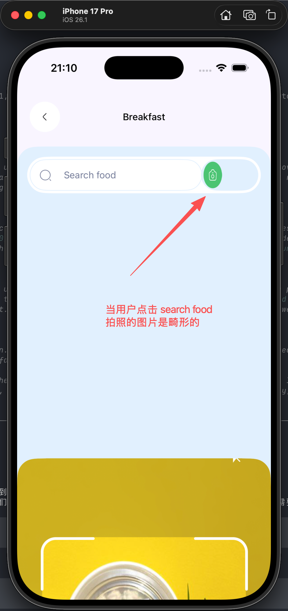
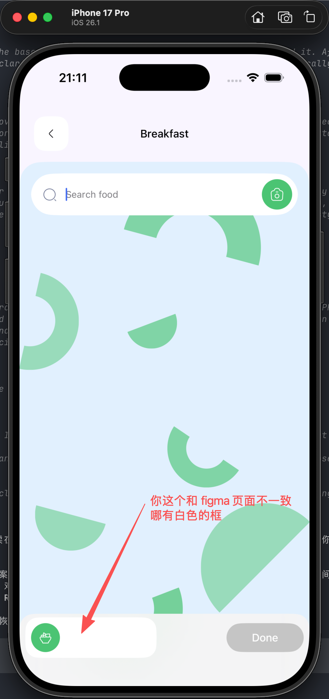
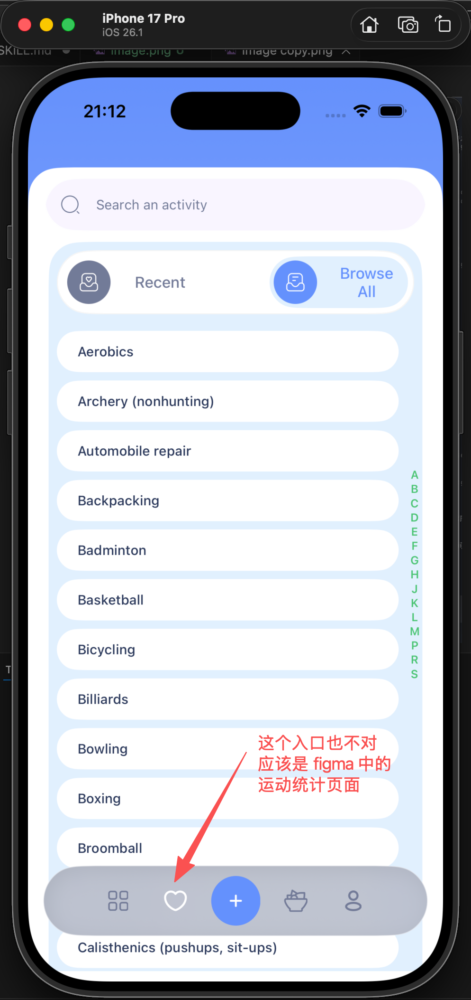
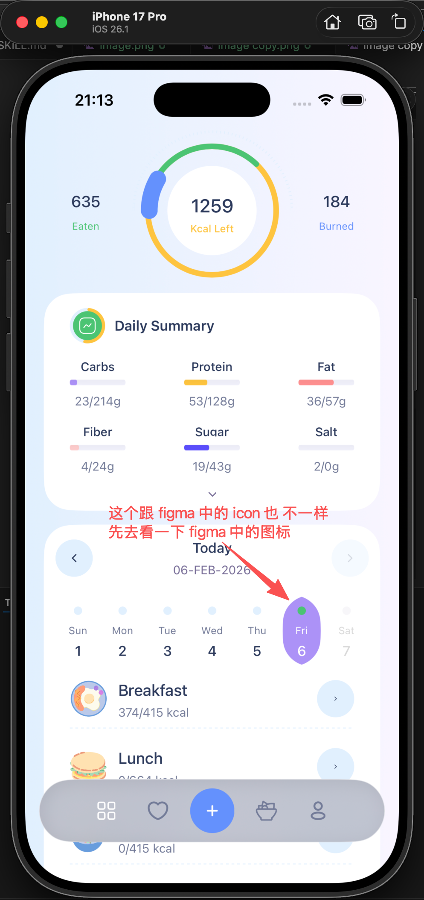
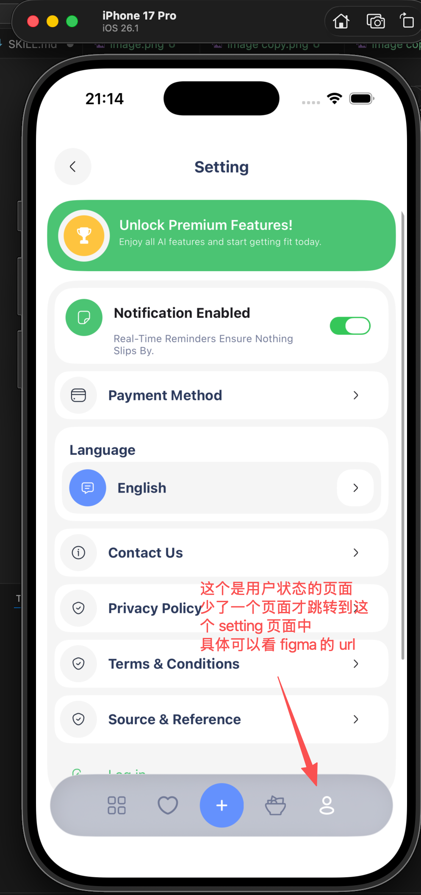

# Figma 对齐修复指令（拍照/搜索/Tab/Stat 入口）

- Saved at: 2026-02-07T00:22:26

## Instruction

Figma 对齐修复指令（拍照/搜索/Tab/Stat 入口）

修复几个问题：
1. 食物拍照页面中动画导致图标变形。
2. 搜索页面与 Figma 不一致，尤其底部 layout 和背景颜色。
3. 运动入口图标与页面入口不对，需对齐到 Workout Checkout 页面。
4. Home 周历当前选中日的 icon 样式不对（应对齐 Figma）。
5. 第 4 个 tab 入口不应直接进 Setting，而应先进 Stat（登录/未登录对应页面），然后通过右上角 icon 跳 Setting。
6. 拍照页图片按钮和拍照按钮的垂直位置需要对齐 Figma。

入口顺序（从左到右）应为：
- Daily 统计
- 运动统计
- 食物 Recipe
- 个人 Stat

Figma 参考：
- https://www.figma.com/design/nin1JX956wFtcKRsHcRMBV/ai-kal-app?node-id=15897-25757&t=dufe3aEOfSAI8Neb-4
- https://www.figma.com/design/nin1JX956wFtcKRsHcRMBV/ai-kal-app?node-id=15897-26044&t=dufe3aEOfSAI8Neb-4
- https://www.figma.com/design/nin1JX956wFtcKRsHcRMBV/ai-kal-app?node-id=15897-26164&t=dufe3aEOfSAI8Neb-4
- https://www.figma.com/design/nin1JX956wFtcKRsHcRMBV/ai-kal-app?node-id=15897-26254&t=dufe3aEOfSAI8Neb-4
- https://www.figma.com/design/nin1JX956wFtcKRsHcRMBV/ai-kal-app?node-id=15897-26100&t=dufe3aEOfSAI8Neb-4
- https://www.figma.com/design/nin1JX956wFtcKRsHcRMBV/ai-kal-app?node-id=15930-19687&t=dufe3aEOfSAI8Neb-4
- https://www.figma.com/design/nin1JX956wFtcKRsHcRMBV/ai-kal-app?node-id=15930-15231&t=dufe3aEOfSAI8Neb-4
- https://www.figma.com/design/nin1JX956wFtcKRsHcRMBV/ai-kal-app?node-id=15930-15298&t=dufe3aEOfSAI8Neb-4
- https://www.figma.com/design/nin1JX956wFtcKRsHcRMBV/ai-kal-app?node-id=15897-15885&t=dufe3aEOfSAI8Neb-4
- https://www.figma.com/design/nin1JX956wFtcKRsHcRMBV/ai-kal-app?node-id=15949-4549&t=dufe3aEOfSAI8Neb-4
- https://www.figma.com/design/nin1JX956wFtcKRsHcRMBV/ai-kal-app?node-id=15949-4650&t=dufe3aEOfSAI8Neb-4

## Images

