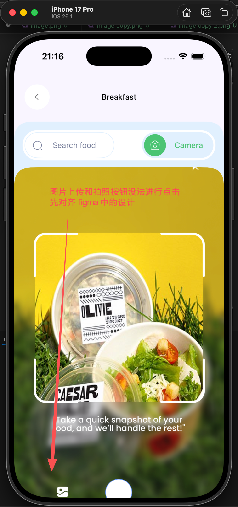

# 修复几个问题

- Saved at: 2026-02-07T00:25:44

## Instruction

修复几个问题
1. 食物拍照页面中 动画导致图标变形[Image #1] 
2.[Image #2]  这个和 figma 中的 不一致，还有一点就是查询页面的背景颜色和 figma 的也不一致
figma url:https://www.figma.com/design/nin1JX956wFtcKRsHcRMBV/ai-kal-app?node-id=15897-26044&t=dufe3aEOfSAI8Neb-4
https://www.figma.com/design/nin1JX956wFtcKRsHcRMBV/ai-kal-app?node-id=15897-26164&t=dufe3aEOfSAI8Neb-4
https://www.figma.com/design/nin1JX956wFtcKRsHcRMBV/ai-kal-app?node-id=15897-26254&t=dufe3aEOfSAI8Neb-4
https://www.figma.com/design/nin1JX956wFtcKRsHcRMBV/ai-kal-app?node-id=15897-26254&t=dufe3aEOfSAI8Neb-4
https://www.figma.com/design/nin1JX956wFtcKRsHcRMBV/ai-kal-app?node-id=15897-26100&t=dufe3aEOfSAI8Neb-4
3.[Image #3] 这个运动图标中和 figma 也不一样， 图片中有说明
这个页面的入口应该是 figma 中的：
https://www.figma.com/design/nin1JX956wFtcKRsHcRMBV/ai-kal-app?node-id=15930-15231&t=dufe3aEOfSAI8Neb-4
https://www.figma.com/design/nin1JX956wFtcKRsHcRMBV/ai-kal-app?node-id=15930-15298&t=dufe3aEOfSAI8Neb-4
4.[Image #4] 这个 icon 图标也不对，你这是锥形，而figma 中的是圆柱形
https://www.figma.com/design/nin1JX956wFtcKRsHcRMBV/ai-kal-app?node-id=15897-15885&t=dufe3aEOfSAI8Neb-4
5.[Image #5] 你这个的入口也不对
在 figma 中是https://www.figma.com/design/nin1JX956wFtcKRsHcRMBV/ai-kal-app?node-id=15949-4549&t=dufe3aEOfSAI8Neb-4
https://www.figma.com/design/nin1JX956wFtcKRsHcRMBV/ai-kal-app?node-id=15949-4650&t=dufe3aEOfSAI8Neb-4
入口， 注意这里有不同状态， 登入未登入的，源码中应该有， 然后才是通过右上角的 icon 才跳转到 setting 中
 6.[Image #6] 图片中的问题解决
 figma url：https://www.figma.com/design/nin1JX956wFtcKRsHcRMBV/ai-kal-app?node-id=15897-25757&t=dufe3aEOfSAI8Neb-4

## Images

